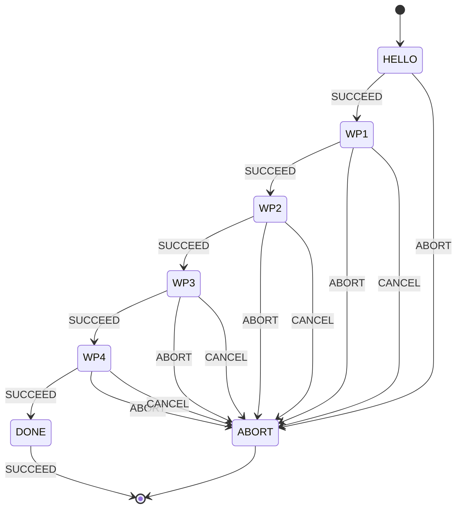

# Learning Period: Waypoint Patrol FSM

Welcome to the Vortex NTNU Autonomy group. This exercise gets you comfortable
with our YASMIN + ROS 2 mission stack by having you finish a small state
machine that sends the drone to 4 fixed waypoints in sequence.

You will **not** write any new ROS 2 action-client code. All the goal-sending
logic already exists as a reusable state (`WaypointGoalState`) in our
`vortex_yasmin_utils` package. Your job is to compose existing building
blocks, plus write one tiny state of your own.

If you've never touched ROS 2 or YASMIN before, that's the point — read
[Concepts](#6-concepts) before you start if any of this is unfamiliar.

## 1. What you're building

Target state machine:



- **HELLO** — your own custom state (`HelloState`). Logs a greeting, always
  returns `SUCCEED`.
- **WP1..WP4** — four `WaypointGoalState` instances, each sending one of the
  four poses in [`config/waypoints.yaml`](config/waypoints.yaml) to the
  `WaypointManager` action server.
- **DONE** — a trivial terminal state that logs completion.
- **ABORT/CANCEL** — if any waypoint state comes back `ABORT` (the action
  server rejected/failed the goal) or `CANCEL` (someone canceled the FSM,
  e.g. Ctrl-C), the machine goes straight to the terminal `ABORT` outcome.
  Nothing tries to retry or recover mid-sequence — that's deliberate, and
  it's also stretch goal #3 below if you want to change it.

## 2. Git workflow

Branch off the shared exercise branch, using your own name:

```shell
git checkout autonomy-learning-period
git pull
git checkout -b learning-period-<your-name>
```

Commit as you go with plain, scoped messages (`git commit -m "wire HELLO and WP1 transitions"`,
not one giant commit at the end). When you're done (see the
[checklist](#9-done-when) below), push and open a PR **against
`autonomy-learning-period`**, not `main`:

```shell
git push -u origin learning-period-<your-name>
```

Then open a PR in GitHub with base branch `autonomy-learning-period`.

## 3. Environment setup

This assumes you already have the full Vortex NTNU ROS 2 workspace checked
out and built (this repo alone does not contain `auv_setup`, `waypoint_manager`,
or the simulator itself — see [Open questions](#open-questions)). From your
workspace root:

```shell
colcon build --packages-up-to learning_period vortex_yasmin_utils
source install/setup.bash
```

**Start the simulator first, on its own, before anything below.** It is not
part of this repo — it lives in `vortex-auv` and has its own tmux launcher,
[`launch_drone_sim.sh`](../../../vortex-auv/utility_scripts/launch_drone_sim.sh).
From your workspace root:

```shell
src/vortex-auv/utility_scripts/launch_drone_sim.sh --scenario default
```

`--scenario` picks the Stonefish world; `default` is fine for this exercise.
Run `launch_drone_sim.sh --help` for the full list (GPU scenarios like
`docking`, `pipeline`, `tacc`, plus `*_no_gpu` variants if you're on a
machine without a GPU). Under the hood this opens its own tmux session
(`drone_launch`, separate from `learning_period` below, so the two don't
collide) with:

- **`sim` window** — `stonefish_sim` itself, plus
  `auv_setup dp_quat.launch.py` (the DP/guidance controller —
  `WaypointGoalState` goals won't converge without this running).
- **`tools` window** — `foxglove_bridge` and a `message_publisher` node, and
  it also opens Foxglove Studio locally if it isn't already running.

Like the script below, re-running it kills any existing `drone_launch`
session first, and `Ctrl-b d` detaches without stopping it.

Once the simulator is up, launch the rest of the stack with the tmux script
written for this exercise, from your workspace root:

```shell
src/vortex-cv/perception_setup/scripts/tmux_learning_period.sh
```

This mirrors the convention every other mission in this repo uses (see
`tmux_pipeline_inspection.sh`, `tmux_valve.sh`,
`tmux_subsea_docking.sh` in the same folder) — one tmux session, `auto`
window, one pane per process. It opens 2 windows:

- **`auto`** (focused on start) — 4 panes:
  1. `ros2 launch waypoint_manager waypoint_manager.launch.py` — the DP/guidance
     action server your `WaypointGoalState`s actually send goals to.
  2. `ros2 launch landmark_server landmark_server.launch.py` — started
     alongside as part of the baseline "auto" stack in every mission here;
     this exercise's FSM doesn't use it directly, but launching without it
     hasn't been tested and mission stacks elsewhere always start it.
  3. `ros2 launch learning_period learning_period_fsm.launch.py` — your FSM.
  4. `ros2 run yasmin_viewer yasmin_viewer_node` — the web viewer (see
     [Inspecting the running FSM](#7-inspecting-the-running-fsm)).
- **`misc`** — 4 empty, sourced panes for whatever else you need
  (`ros2 topic echo`, `rqt`, etc.).

Detach with `Ctrl-b d` (session keeps running), reattach with
`tmux attach -t learning_period`, or just re-run the script — it kills any
existing `learning_period` session first. Useful flags:

```shell
./tmux_learning_period.sh --drone nautilus --domain-id 0
```

## 4. Task list

Work through these in order. Each step names the file and the
`// TODO(member)` marker to look for.

1. **Write `HelloState`.**
   File: [`mission/vortex_yasmin_utils/src/hello_state.cpp`](../vortex_yasmin_utils/src/hello_state.cpp).
   That file is deliberately close to empty: it has the right includes, the
   right namespace, and a TODO block. **Everything else you write yourself.**

   The header, [`hello_state.hpp`](../vortex_yasmin_utils/include/vortex_yasmin_utils/hello_state.hpp),
   is your spec — don't change it. It declares exactly two things you must
   define:
   ```cpp
   HelloState();
   std::string execute(yasmin::Blackboard::SharedPtr blackboard) override;
   ```
   What you need to work out for yourself:
   - **The constructor.** Every `yasmin::State` must declare, up front, the
     complete set of outcome strings it is allowed to return. That set is
     passed to the `yasmin::State` base constructor. `HelloState` only ever
     succeeds, so its set has one element. Where does the `SUCCEED` string
     come from? `yasmin_ros::basic_outcomes` — use the constant, never a
     raw `"SUCCEED"` literal, so a typo is a compile error rather than a
     state machine that silently never transitions.
   - **`execute()`.** Log something with `YASMIN_LOG_INFO(...)` (from
     `<yasmin_ros/ros_logs.hpp>`) and return an outcome. Returning an
     outcome you didn't declare in the constructor is a runtime error.

   If you get stuck on the *shape* of it, read
   [`wipe_state.cpp`](../vortex_yasmin_utils/src/wipe_state.cpp) in the same
   directory — the simplest finished state in the repo. Yours is smaller:
   no publisher, no node handle, just a log line.

   **Verify:** nothing yet. `colcon build --packages-select vortex_yasmin_utils`
   will succeed *even if this file is complete nonsense*, because the file
   isn't part of the build until step 2. That's the point of step 2.

2. **Wire `hello_state.cpp` into the build.**
   File: [`mission/vortex_yasmin_utils/CMakeLists.txt`](../vortex_yasmin_utils/CMakeLists.txt),
   look for the `# TODO(member)` comment right above `add_library(vortex_yasmin_utils`.
   A `.cpp` file that isn't listed in `add_library()`/`add_executable()`
   never gets compiled, no matter how correct its header is — CMake has no
   idea it exists otherwise. Add `src/hello_state.cpp` to that list
   (alphabetically, next to its neighbors).
   `package.xml` does **not** need a new `<depend>` for this — `HelloState`
   only uses `yasmin`/`yasmin_ros`, which `vortex_yasmin_utils/package.xml`
   already depends on. You only need to add a `<depend>` line when a state
   uses a ROS package that isn't declared yet (e.g. if you'd used
   `nav_msgs`, you'd add `<depend>nav_msgs</depend>` there too).
   **Verify:** `colcon build --packages-select vortex_yasmin_utils` — this is
   the first time your step-1 code is actually compiled, so this is where
   typos in it show up. Fix them before moving on. Skipping this step
   entirely instead makes step 4 fail at link time with
   `undefined reference to vortex_yasmin_utils::HelloState::HelloState()`.

3. **Construct the 5 states.**
   File: [`src/build_state_machine.cpp`](src/build_state_machine.cpp),
   `TODO(member) 1 of 3` and `TODO(member) 2 of 3`. Construct one
   `HelloState` and four `WaypointGoalState`s.

   **Read the reference first:**
   [`visual_inspection_fsm/src/build_state_machine.cpp`](../tacc/visual_inspection/visual_inspection_fsm/src/build_state_machine.cpp).
   It is a real mission FSM built exactly the way yours will be, and it
   demonstrates every piece you need:
   - it pulls `WaypointGoal`s off the blackboard by key at the top of the
     function (`blackboard->get<vortex::utils::waypoints::WaypointGoal>("standoff_goal")`)
     — you do the same with `"waypoint_1_goal"` .. `"waypoint_4_goal"`;
   - it constructs an argument-less state (`WipeState`) — same shape as your
     `HelloState`;
   - it passes `config.waypoint_manager_action_server` into every state that
     talks to the waypoint manager — yours needs it too.

   Check [`waypoint_goal_state.hpp`](../vortex_yasmin_utils/include/vortex_yasmin_utils/waypoint_goal_state.hpp)
   for the exact constructor arguments rather than guessing.
   **Verify:** it compiles (expect unused-variable warnings until step 4).

4. **Wire the transition table.**
   Same file, `TODO(member) 3 of 3`. This is the actual state machine: a set
   of `sm->add_state(name, state, transitions)` calls, where `transitions`
   maps **every outcome that state can return** to the name of the next
   state.

   The same reference file shows the finished pattern —
   [`visual_inspection_fsm/src/build_state_machine.cpp`](../tacc/visual_inspection/visual_inspection_fsm/src/build_state_machine.cpp)
   chains 7 states this way, including a final `"DONE"` built inline with
   `yasmin::CbState::make_shared(...)` that just logs and returns `SUCCEED`.
   Build your `DONE` the same way.

   Four rules that decide whether it works:
   - **The first `add_state()` call is the entry point.** So `HELLO` must be
     added first — order matters here and nowhere else.
   - **A state's transition map must cover every outcome it declared.**
     `HelloState` declares only `SUCCEED`. `WaypointGoalState` is an
     `ActionState`, so it declares `SUCCEED`, `ABORT` *and* `CANCEL`. Miss
     one and yasmin throws while building the machine.
   - **A transition target is either a state name or a terminal outcome.**
     `{SUCCEED, "WP2"}` moves to another state; `{ABORT, ABORT}` ends the
     whole machine with the terminal `ABORT` outcome (the set passed to the
     `StateMachine` constructor at the top of the function). Notice
     `{{SUCCEED, SUCCEED}}` on the `DONE` state in the reference — that's
     the terminal-outcome form, not a self-loop.
   - **Names are resolved at build time**, so a typo'd target fails loudly
     at startup instead of halfway through a mission.

   For this exercise send both `ABORT` and `CANCEL` straight to the terminal
   `ABORT` outcome — no mid-sequence recovery (that's stretch goal 3).
   Delete the `"PLACEHOLDER"` state once your real states are wired in.
   **Verify:** `colcon build --packages-select learning_period` succeeds with
   no warnings about unused `hello`/`wp1`../`wp4` variables, and no
   `undefined reference` errors at link time (if you see one for
   `HelloState`, go back to step 2).

5. **Run it.**
   With the simulator, waypoint manager, and viewer running (see above),
   launch your FSM and confirm it visits all 4 waypoints and ends on
   `SUCCEED`. Watch it in the viewer at http://localhost:5000/.

6. **Play with the config.** Change numbers in
   [`config/waypoints.yaml`](config/waypoints.yaml) and re-run — no C++
   edits. See [Why the waypoints live in YAML](#5-why-the-waypoints-live-in-yaml)
   below for what to try.

## 5. Why the waypoints live in YAML

Notice what `build_state_machine.cpp` does *not* contain: any coordinates.
The chain is

```
config/waypoints.yaml
  -> launch/learning_period_fsm.launch.py   (passes the file path as the
                                             `waypoint_config` ROS parameter)
  -> load_config()          in src/blackboard.cpp  (reads that parameter)
  -> initialize_blackboard() in src/blackboard.cpp (parses YAML into 4
                                             WaypointGoal structs, puts them
                                             on the blackboard)
  -> build_state_machine()  (pulls them off by key, hands them to states)
```

Why bother, when four hardcoded poses would be shorter?

- **Tuning without rebuilding.** Editing YAML and relaunching takes seconds;
  editing C++ means `colcon build` every time. On the pool deck, where the
  useful numbers are found by trial and error, that difference is the whole
  workday.
- **The same binary runs different missions.** The action server name and
  the config path are both ROS parameters, so the launch file — not the code
  — decides which robot, namespace and waypoint set you're driving. That's
  how every other mission in this repo works too.
- **Non-programmers can change behaviour.** Anyone who can edit a text file
  can move a waypoint. Nobody has to read C++ to know where the drone will
  go.
- **The code stays about *logic*, not *data*.** `build_state_machine.cpp`
  reads as "hello, then four waypoints, then done" — the order and the
  failure handling, which is the part worth reviewing.

**Go break it on purpose.** Each of these is one YAML edit plus a relaunch
(the file is installed by `colcon build`, so re-run
`colcon build --packages-select learning_period` — or edit the installed
copy under `install/learning_period/share/learning_period/config/` for a
faster loop):

- Change a `position` — move `waypoint_2` from a 3×3 m square to 6×6 m and
  watch the patrol get bigger.
- Change `convergence_threshold` from `0.3` to `2.0`. The waypoint now
  "succeeds" as soon as the drone is within 2 m, so it cuts corners and the
  run finishes much faster. Drop it to `0.05` instead and watch it fuss at
  each corner — or never converge at all, because the controller can't hold
  that tightly. This is the single most useful number to develop intuition
  for.
- Change a `yaw` and see which way the drone points on arrival. Values are
  in **degrees** (see [Open questions](#open-questions)) — `config/waypoints.yaml`
  uses `0` / `90` / `180` / `-90`.
- Change `mode` from `full_pose` and see what the loader accepts — read
  `vortex/utils/waypoint_utils.hpp` for the valid values.
- Delete the `waypoint_3` block entirely. You get a startup failure from
  `load_waypoint_goal_from_yaml()`, not a silent wrong mission. Note where
  that error surfaces (node startup, before any state runs) — that's the
  behaviour you want from config loading.

## 6. Concepts

If you're new to ROS 2 / YASMIN, here's the minimum vocabulary you need:

- **State** — one node in the state machine's graph. Has an `execute()`
  method that does some work and returns an **outcome** string.
- **Outcome** — the string a state returns from `execute()` (e.g.
  `"SUCCEED"`, `"ABORT"`). It's just a label the state machine uses to
  decide where to go next.
- **Transition** — a mapping from `(state, outcome) -> next_state`, given as
  the third argument to `add_state()`. This is the actual "wiring" of the
  machine.
- **Blackboard** — a shared key-value store (`yasmin::Blackboard`) passed to
  every state's `execute()`. It's how states that run at different times
  share data without knowing about each other directly. In this exercise
  it's used to hand the 4 loaded `WaypointGoal` structs from
  `initialize_blackboard()` to `build_state_machine()`.
- **ActionState** (`yasmin_ros::ActionState<ActionT>`) — a state that wraps
  a ROS 2 action client: it sends a goal on `execute()`, blocks until the
  action server returns a result, and maps that result to an outcome.
  `WaypointGoalState` is one of these, specialized for
  `vortex_msgs::action::WaypointManager`.
- **Why use `WaypointGoalState` instead of writing an action client
  yourself?** Because a hand-rolled `rclcpp_action` client is ~80 lines of
  goal handles, futures, and callback boilerplate — and this repo already
  has that logic written, tested, and used in 3 other missions. The
  point of this exercise is composition: you decide *which* waypoints to
  visit and *in what order*, not *how* to talk to the action server.

## 7. Inspecting the running FSM

The **YASMIN viewer** shows your state machine's graph and current state
live in a browser:

```shell
ros2 run yasmin_viewer yasmin_viewer_node
# open http://localhost:5000/ and select LEARNING_PERIOD_FSM
```

Useful commands while debugging:

```shell
# Is your FSM node up, and what does it see?
ros2 node list
ros2 node info /learning_period_fsm

# Is the waypoint_manager action server actually there?
ros2 action list
ros2 action info /<namespace>/waypoint_manager

# Watch goals/results/feedback going to the action server directly
ros2 action send_goal /<namespace>/waypoint_manager \
  vortex_msgs/action/WaypointManager \
  "{waypoints: [{pose: {position: {x: 1.0, y: 0.0, z: 2.0}}}], convergence_threshold: 0.3, persistent: false}"

# Is odometry actually flowing? (WaypointManager can't converge without it)
ros2 topic hz /<namespace>/nucleus/odom
ros2 topic echo /<namespace>/nucleus/odom --once
```

## 8. Troubleshooting

- **Goal rejected immediately.** Check `ros2 action list` — if
  `/<namespace>/waypoint_manager` isn't listed, the waypoint manager node
  (Terminal 2 above) isn't running or is on a different namespace than your
  FSM's launch file resolved. Check the `action_servers.waypoint_manager`
  parameter your node actually got: `ros2 node info /learning_period_fsm`.
- **No odom / never converges.** `WaypointGoalState` will hang waiting for
  the action to complete if the vehicle never reaches the goal. Confirm
  odometry is publishing (`ros2 topic hz .../odom`) and that your waypoint
  poses in `config/waypoints.yaml` are actually reachable from the sim's
  spawn point — the 4 defaults here form a 3×3 m square at 2.0 m depth
  (NED: z positive = down) around the origin, which may not match your sim
  world.
- **State machine ends immediately with no waypoints visited.** You
  probably still have the `"PLACEHOLDER"` state in
  `build_state_machine.cpp` — it logs a warning and immediately returns
  `SUCCEED`. Delete it once your real states are added.
- **Link/build errors mentioning `HelloState` undefined reference.** You
  skipped (or mistyped) task step 2 — `src/hello_state.cpp` isn't in
  `vortex_yasmin_utils/CMakeLists.txt`'s `add_library()` sources list yet,
  so the symbol was declared in the header but never compiled anywhere.
  Same failure mode applies to any `.cpp` you add in the future: a file not
  listed in `add_library`/`add_executable` simply doesn't exist to the
  linker, and removing `install(DIRECTORY include/ ...)` / `ament_export_*`
  lines breaks it for downstream packages the same way.
- **`colcon build` can't find `vortex_yasmin_utils` (or `vortex_msgs`,
  `vortex_utils`) at all.** These come from external repos pulled in via
  [`dependencies.repos`](../../dependencies.repos) — make sure your
  workspace's `src/` actually has them checked out and built, not just this
  repo.

## 9. Done when

- [ ] `colcon build` succeeds with no errors or new warnings.
- [ ] `src/hello_state.cpp` is listed in `vortex_yasmin_utils/CMakeLists.txt`'s
      `add_library()` sources.
- [ ] `HelloState::execute()` logs a message and the FSM's terminal logs show
      it running first.
- [ ] The FSM visits all 4 waypoints in order (visible in the YASMIN viewer
      and/or the drone's actual movement in sim) and ends on `SUCCEED`.
- [ ] The `"PLACEHOLDER"` state is gone from `build_state_machine.cpp`.
- [ ] You can explain, in your PR description, what `SUCCEED`/`ABORT`/`CANCEL`
      mean for this specific machine and what happens on each.

**Stretch goals** (pick 0-3, not required):

1. Loop the 4 waypoints indefinitely instead of ending at `DONE`.
2. Add a state that records `now() - leg_start_time` around each waypoint
   leg and logs it — a first taste of `yasmin::Blackboard` being used for
   more than static config.
3. Instead of sending every `ABORT`/`CANCEL` straight to the terminal
   `ABORT` outcome, retry the failed waypoint exactly once before giving up.

## 10. Links

- YASMIN repo: <https://github.com/uleroboticsgroup/yasmin>
- YASMIN docs (viewer, states, demos): <https://uleroboticsgroup.github.io/yasmin/>
- `yasmin_ros` package index: <https://index.ros.org/p/yasmin_ros/>
- ROS 2 actions concept (Humble): <https://docs.ros.org/en/humble/Concepts/Basic/About-Actions.html>
- ROS 2 C++ action client tutorial (Humble): <https://docs.ros.org/en/humble/Tutorials/Intermediate/Writing-an-Action-Server-Client/Cpp.html>
- `WaypointGoalState` (the state you're using):
  [`mission/vortex_yasmin_utils/include/vortex_yasmin_utils/waypoint_goal_state.hpp`](../vortex_yasmin_utils/include/vortex_yasmin_utils/waypoint_goal_state.hpp)
- A real mission FSM to reference for style/patterns:
  [`mission/tacc/subsea_docking/subsea_docking_fsm/`](../tacc/subsea_docking/subsea_docking_fsm/)

## Open questions

Things I (the scaffold author) couldn't verify from this repo alone — ask in
the group channel or update this section once you know:

- ~~**Exact simulator launch command.**~~ Resolved: it lives in `vortex-auv`,
  not `vortex-cv` — see [`launch_drone_sim.sh`](../../../vortex-auv/utility_scripts/launch_drone_sim.sh)
  and the [Environment setup](#3-environment-setup) section above. The
  `--sim`/`--real` flags on the `tmux_*.sh` scripts in
  `perception_setup/scripts/` are unrelated: they only tell the *camera*
  launch files whether to skip the real driver and trust that something else
  is already publishing on those topics (see e.g. the `sim` arg in
  `perception_setup/launch/mission/pipeline_inspection/pipeline_inspection_front_camera.launch.py`).
- **Goal frame.** Every other FSM in this repo sends `WaypointManager`
  goals in the `{namespace}/odom` frame by convention (poses are an
  unstamped `geometry_msgs/Pose`, so the frame isn't in the message itself
  — it's enforced by the receiving node). `config/waypoints.yaml` assumes
  this frame **with the NED convention** (x North, y East, z Down, so depth
  is positive z); confirm against the actual `waypoint_manager` node if
  goals land in unexpected places (in particular, if the sim publishes odom
  z-up, flip the sign of every `position.z`).
- ~~**Orientation units (`roll`/`pitch`/`yaw`) in the waypoint YAML.**~~
  Resolved: **degrees**. `load_pose_for_mode()` in
  `vortex_utils/src/waypoint_utils.cpp` multiplies each of roll/pitch/yaw by
  `M_PI / 180.0` before building the quaternion, so the YAML must hold plain
  degrees. The loader docstring's `yaw: 3.14159` example is misleading — it
  would be read as 3.14°, not π rad. `config/waypoints.yaml` now uses
  degrees.
- **Whether anything needs to "enable" DP/autonomous mode before
  `WaypointManager` goals are accepted.** No such service call appears
  anywhere in this repo's mission code — either none is needed, or it's
  handled inside the external `waypoint_manager` node itself.
